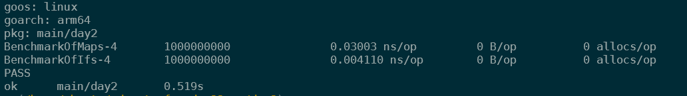

# Advent of Code 2022: Go

I am a noob to Go! This year I want to use the AoC as an excuse to play with language. Hopefully my code doesn't make those experienced with Go queasy! :wink:

To see more Go AoC solutions, check out [this awesome collection of repos](https://github.com/Bogdanp/awesome-advent-of-code/blob/master/README.md#go)!

[Day 1 Challenge](https://adventofcode.com/2022/day/1) | [Day 1 Source Code](./day1/day1.go) 

[Day 2 Challenge](https://adventofcode.com/2022/day/2) | [Day 2 Source Code Using If & Else's](./day2/day2.go) |  [Day 2 Source Code Using Maps](./day2/day2_maps.go) 

At first I thought I wrote a shitty solution with a bunch of if and else statements. So I wrote one using maps and it really reduced the amount of lines of code. However using go test benchmarking, I noticed the if else solution is much faster! I would be curious to try it with slices to see where this falls. So sometimes if else's might be more optimal, even if it's ugly! :wink:

[Day 3 Challenge](https://adventofcode.com/2022/day/3) | [Day 3 Source Code](./day3/day3.go) 

[Day 4 Challenge](https://adventofcode.com/2022/day/4) | [Day 4 Source Code](./day4/day4.go) 

[Day 5 Challenge](https://adventofcode.com/2022/day/5) | [Day 5 Source Code](./day5/day5.go) 

