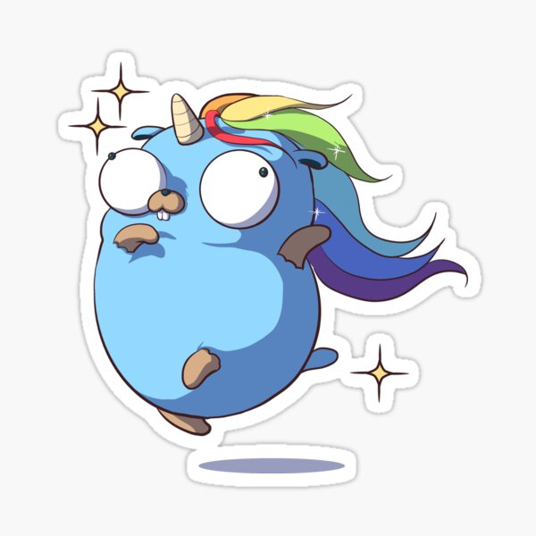

# Advent of Code 2022: Go

I am a noob to Go! This year I want to use the AoC as an excuse to play with language. Hopefully my code doesn't make those experienced with Go queasy! :wink:

[Day 1 Challenge](https://adventofcode.com/2022/day/1) | [Day 1 Source Code](./day1/day1.go) 
[Day 2 Challenge](https://adventofcode.com/2022/day/2) | [Day 2 Source Code](./day1/day2.go) 
